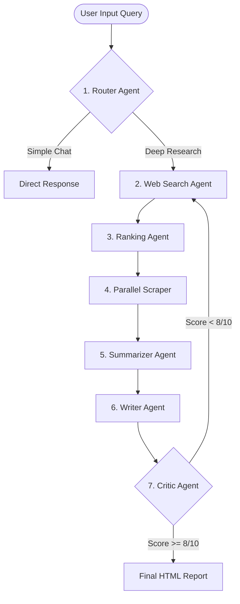

# Prism: Multi-Agent Deep Research System

Prism is an advanced agentic deep research assistant that coordinates seven specialized AI agents to search, scrape, evaluate, summarize, write, and verify high-quality reports on any query.

---

## 🏗️ System Architecture & Agent Workflow

Prism orchestrates an autonomous sequence of LangChain-based agents to perform thorough intelligence-gathering tasks.



### The 7 Specialized Agents:
1. **Router Agent**: Analyzes incoming queries to classify intent. Decides if a request needs the full deep research pipeline or can be handled as a direct conversational answer.
2. **Web Search Agent**: Utilizes the Tavily Search API to identify the most relevant online sources, articles, and whitepapers.
3. **Ranking Agent**: Scores and ranks retrieved search results, weeding out low-authority blogs or duplicate pages.
4. **Parallel Scraper**: Launches concurrent workers to fetch and extract raw content from the highest-ranked URLs.
5. **Summarizer Agent**: Compresses scraped website text into highly dense factual key points, keeping token usage efficient.
6. **Writer Agent**: Organizes summaries and writes a formal, structured report (comprising Introduction, Findings, and Conclusions).
7. **Critic Agent**: Reviews the written draft, scores it from 0–10, and either approves it or flags missing data to trigger a rewrite.

---

## 🛠️ Key Challenges Faced & Solved

During the development of the Python backend and React frontend, several design, state, and rendering bugs were resolved to create a polished, production-grade application:

### 1. Monospace & Monolith Markdown Rendering Issues
* **The Problem**: Raw markdown headings (`#`, `##`) rendered in browser default unstyled headings, which scaled massively and used a blocky monospace font that made the report look cluttered.
* **The Solution**: Developed a custom `<MarkdownRenderer />` component that parses markdown syntax into semantic HTML elements styled with explicit `'px'` units and set to the modern `Inter` sans-serif font family.

### 2. State Locks on Input Clear
* **The Problem**: Disabling the main text input (`disabled={isRunning}`) during execution caused the browser DOM to ignore the state-clearing cycle (`setQuery('')`), trapping search text in the input box.
* **The Solution**: Replaced `disabled` with `readOnly={isRunning}`. This locks typing while allowing the React virtual DOM to successfully clear the input on submit.

### 3. Sidebar Resizing Collision
* **The Problem**: Adding drag-to-resize handlers to both the left session history and right pipeline sidebars allowed sidebars to collide in the center, overlapping and squishing the chat area to zero.
* **The Solution**: Implemented mathematical boundary constraints in the mousemove event listeners:
  $$\text{maxLeftWidth} = \text{innerWidth} - \text{rightWidth} - 360\text{px}$$
  This guarantees the center workspace always maintains a minimum width of $360\text{px}$, preventing collisions.

### 4. Color Palette Overhaul
* **The Problem**: The default application used basic greens and generic colors that did not look modern.
* **The Solution**: Styled the entire layout (backgrounds, borders, buttons, cards, and canvas animations) using a premium slate-monochrome palette:
  * `#EDEFF0` (Primary Light Text)
  * `#C2C9CC` (Secondary Muted Grey)
  * `#9BA3A8` (Muted Controls)
  * `#7B8285` (Slate Accent)
  * `#595F61` (Dark Muted Slate)
  * `#383B3D` (Borders & Dividers)
  * `#191B1C` (Core Dark Background)

---

## 🚀 Local Development Setup

### Backend (Python/Flask)
1. Navigate to the root directory.
2. Install virtual environment and packages:
   ```bash
   python -m venv .venv
   .venv\Scripts\activate
   pip install -r requirements.txt
   ```
3. Create a `.env` file in the root directory:
   ```env
   MISTRAL_API_KEY=your_key_here
   TAVILY_API_KEY=your_key_here
   ```
4. Run the Flask server:
   ```bash
   python app.py
   ```

### Frontend (React/Vite)
1. Navigate to the frontend directory:
   ```bash
   cd frontend
   npm install
   npm run dev
   ```
2. Open [http://localhost:5173](http://localhost:5173) in your browser.

---

## 📦 Production Deployment (Render Monolith)

Prism is fully optimized for **monolith deployment** on platforms like Render:
* **Build Command**: `pip install -r requirements.txt && cd frontend && npm install && npm run build`
* **Start Command**: `gunicorn app:app`
* **Environment Variables**: Make sure to add `MISTRAL_API_KEY` and `TAVILY_API_KEY` to the Render Dashboard settings.
