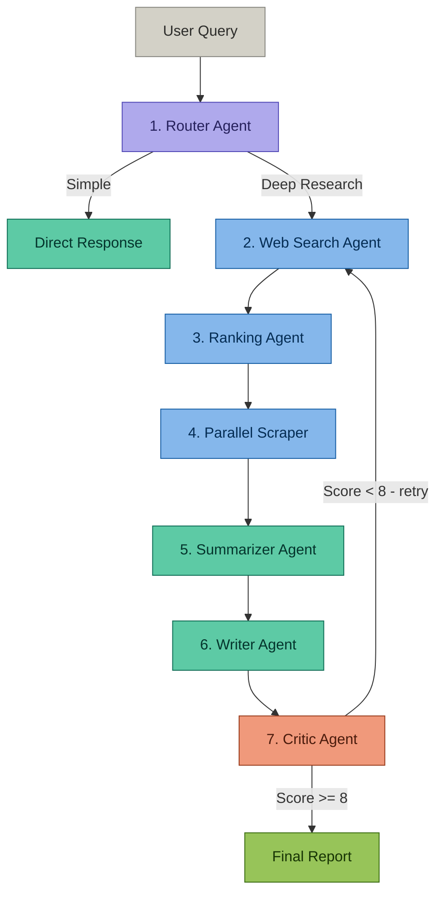

# 🌌 Prism: Multi-Agent Deep Research System

Prism is an advanced agentic deep research framework that orchestrates multiple specialized AI agents to autonomously search, evaluate, synthesize, and verify information from the web and generate structured, high-quality research reports.

It is built as a modular LangChain-based pipeline that replicates a real-world research workflow — from query understanding to final report validation.

---

## 🧠 Core Idea

Instead of relying on a single LLM call, Prism decomposes research into **7 specialized AI agents**, each responsible for a distinct stage of intelligence gathering and reasoning.

This improves:
- Factual accuracy
- Source reliability
- Output structure
- Hallucination reduction
- Self-evaluation through feedback loops

---

## 🏗️ System Architecture



---

## 🧩 Key Challenges Faced & Solutions (Backend / Python Only)

During the development of the Prism backend (Python-based agentic pipeline and terminal execution system), several challenges were encountered in building a stable multi-agent workflow.

### 1. Inconsistent Agent Output Format

**Problem:**
Different agents (Router, Search, Ranking, Summarizer) were returning inconsistent outputs (sometimes plain text, sometimes partial JSON), which broke downstream parsing in the pipeline.

**Solution:**
Standardized all agent outputs using a strict JSON schema contract, ensuring every agent returns structured, machine-readable data.

### 2. Web Search Noise & Irrelevant Results

**Problem:**
Tavily search results often included irrelevant blogs, SEO-heavy pages, or duplicated links, which reduced final report quality.

**Solution:**
Implemented a Ranking Agent filtering layer:
- Keyword relevance scoring
- Domain-level quality filtering
- Duplicate URL removal
- Penalty scoring for low-content pages

### 3. Scraper Failures & Partial Content Extraction

**Problem:**
Some URLs failed during scraping due to request timeouts, blocked access, or JavaScript-rendered content, causing incomplete or empty summaries.

**Solution:**
Added:
- Retry mechanism with exponential backoff
- Timeout handling per request
- Fallback raw HTML extraction
- Parallel scraping for stability and speed

### 4. Token Overflow in LLM Processing

**Problem:**
Large scraped web pages exceeded LLM context limits, causing API errors or truncated outputs.

**Solution:**
Implemented a chunk-based processing pipeline:
- Split content into smaller chunks
- Summarize each chunk independently
- Merge summaries into final structured output

### 5. Agent Pipeline Breaks During Execution Flow

**Problem:**
When intermediate agents returned empty or malformed data, the entire pipeline would crash or produce invalid final reports.

**Solution:**
Introduced pipeline validation gates:
- Check output before passing to next agent
- Retry search/scrape if data is insufficient
- Fail-safe fallback messages for empty results

### 6. Infinite Loop in Critic Feedback Cycle

**Problem:**
Critic Agent sometimes kept rejecting outputs repeatedly, causing the system to loop indefinitely between Writer → Critic → Writer.

**Solution:**
Added:
- Maximum iteration cap (2–3 cycles)
- Structured scoring system (0–10)
- Strict acceptance threshold (≥ 8/10)

### 7. Loss of Context Between Agents

**Problem:**
Each agent worked independently, causing loss of context (query intent, earlier findings, ranked URLs).

**Solution:**
Built a shared pipeline state object that stores:
- Original query
- Search results
- Ranked URLs
- Intermediate summaries
- Final draft

This ensured continuity across the entire pipeline.

### 8. API Rate Limits & Cost Spikes

**Problem:**
Frequent calls to LLM and Tavily APIs caused rate limiting errors and increased token usage cost.

**Solution:**
Optimized pipeline by:
- Caching repeated queries
- Reducing redundant LLM calls
- Batching scraping requests instead of sequential execution

---

## 🚀 Local Development Setup

### Backend (Python/Flask)

1. Navigate to the root directory.
2. Install virtual environment and packages:
   ```bash
   python -m venv .venv
   .venv\Scripts\activate
   pip install -r requirements.txt
   ```
3. Create a `.env` file in the root directory:
   ```env
   MISTRAL_API_KEY=your_key_here
   TAVILY_API_KEY=your_key_here
   ```
4. Run the Flask server:
   ```bash
   python app.py
   ```

### Frontend (React/Vite)

1. Navigate to the frontend directory:
   ```bash
   cd frontend
   npm install
   npm run dev
   ```
2. Open [http://localhost:5173](http://localhost:5173) in your browser.

---

## 📦 Production Deployment (Render Monolith)

Prism is fully optimized for **monolith deployment** on platforms like Render:

* **Build Command**: `pip install -r requirements.txt && cd frontend && npm install && npm run build`
* **Start Command**: `gunicorn app:app`
* **Environment Variables**: Make sure to add `MISTRAL_API_KEY` and `TAVILY_API_KEY` to the Render Dashboard settings.
